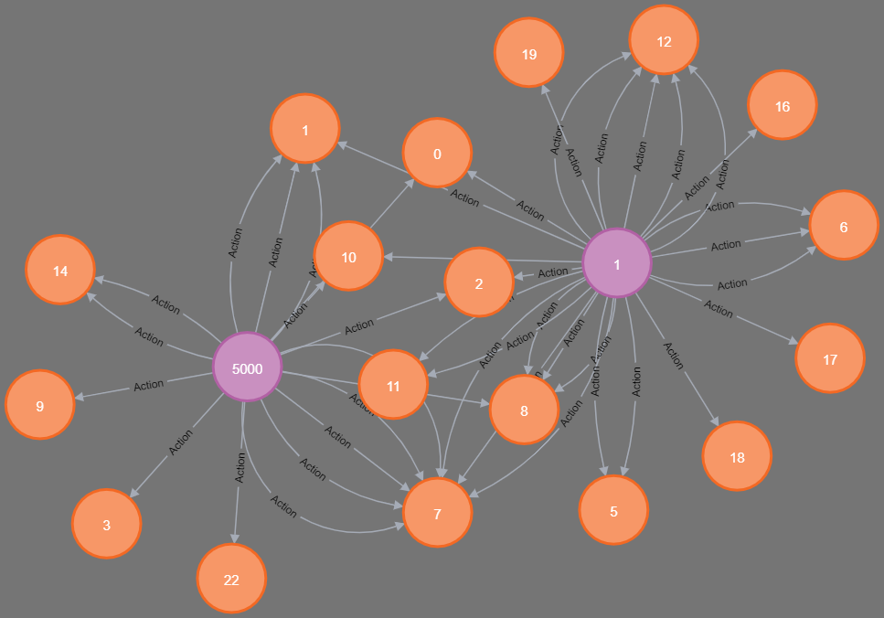

# Stanford Large Network Analysis with Neo4j and Python

## Overview

This repository contains a Python project for analyzing a Large Social Network dataset using Neo4j, a highly scalable graph database. The dataset used in this project is Stanford's "Social Network: MOOC User Action Dataset", which provides valuable insights into user interactions within online learning environments. The project includes scripts for creating the database, loading the dataset, executing, and benchmarking queries on the graph database.

### Dataset
The MOOC user action dataset represents the actions taken by users on a popular MOOC platform. The actions are represented as a directed, temporal network. The nodes represent users and course activities (targets), and edges represent the actions by users on the targets. The actions have attributes and timestamps. To protect user privacy, we anonimize the users and timestamps are standardized to start from timestamp 0. The dataset is directed, temporal, and attributed.

Additionally, each action has a binary label, representing whether the user dropped-out of the course after this action, i.e., whether this is last action of the user.

| Dataset Statistics           |                   |
|------------------------------|-------------------|
| Number of users              | 7,047             |
| Number of targets            | 97                |
| Number of actions            | 411,749           |
| Number of positive labels    | 4,066             |
| Timestamp                    | seconds           |

More info about the dataset can be found [here](https://snap.stanford.edu/data/act-mooc.html).

### Dataset Files
| File                     | Description                                                                       |
|--------------------------|-----------------------------------------------------------------------------------|
| mooc_actions.tsv         | Time-ordered sequence of user actions.                                            |
| mooc_action_features.tsv| Features associated with each action.                                             |
| mooc_action_labels.tsv  | Binary label associated with each action, indicating whether the student drops out after the action. |


Purple nodes represent users, orange nodes represent targets, and edges represent actions taken by users on targets.

### Python Files Information:

- **queries.py**: Executes and benchmarks queries by connecting to Neo4j utilizing `result_consume_after` for time measurement.

- **graphdb.py**: Establishes connection with the Neo4j server and includes methods for query execution, batch execution, and driver closing.

- **createGraphDB.py**: Initializes the database as explained below.

- **loadData.py**: Includes helper methods for reading and parsing the MOOC dataset files, as well as creating Cypher queries and CSV files. It is used by `createGraphDB.py`.

### Cypher Files Information:

- **bulk-insert-actions.cypher**: Contains a query for bulk loading the action records appearing in the `actions.csv` file created by `createGraphDB.py`. It uses transactions and is faster than insertion via Python.

- **queries.cypher**: Contains queries.

- **users.cypher** and **targets.cypher**: Files that can be generated by `loadData.py` for direct execution within the Neo4j browser. They include queries for creating the `:User` and `:Target` nodes, respectively.

- **indices.cypher**: Contains queries for creating indexes on `:User` and `:Target` on the `id` field. Necessary for fast execution of match-merge queries.

- **constraints.cypher**: Contains queries that create constraints on `:User` and `:Target` on the `id` field.

### Instructions 
To create the database in Neo4j, execute the `createGraphDB.py` file. Upon execution, nodes `:User` and `:Target` are created in the database, along with indexes on `:User` and `:Target` on the `id` field.
- If the variable `createRelationshipsFromPython` is `False`, the `actions.csv` file is created in the `act-mooc` folder, containing the `:Action` relationships. In this case, the CSV file must be moved to the directory where the database is stored: `(project_name)/dbmss/dbms-***-***.../import`. Then run the `bulk-insert-actions.cypher` file in Neo4j browser.
- If the variable is `True`, the script creates batches of actions and executes them in transactions.

##### Execution via the Cypher script `bulk-insert-actions`, is optimized and runs in a few milliseconds, unlike the insertion from `createGraphDB.py`, which takes a few minutes!

###### The password used to connect to the Neo4j database in `queries.py` and `createGraphDB.py` is: `moocmooc` and can be changed within the scripts.

#### Requirements

To run this project, you need to have the following dependencies installed:

- Python 3.x
- Neo4j Database
- Python library: `neo4j`

You can install the Python dependencies using pip:

```bash
pip install neo4j
```
